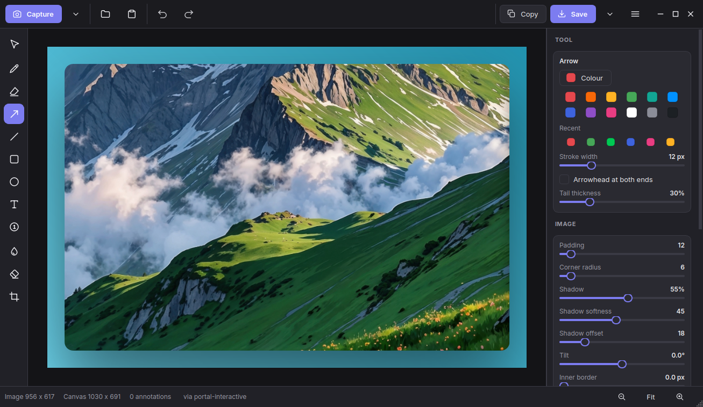

# Shotpad

A screenshot capture-and-annotate app for Linux, built to work the same on
**GNOME, KDE Plasma, XFCE, MATE, Cinnamon and LXQt** — on X11 and Wayland alike
— and shipped as a single **AppImage**.

Take a shot, drop it on a gradient with padding and a soft shadow, point at
things with arrows, scribble with the pen, blur out the parts nobody should
see, and copy or save the result.



---

## Features

### Beautify

| | |
|---|---|
| **Padding** | 0–200 (default 12), scales with the image so it looks right at any resolution |
| **Backgrounds** | Linear / radial / conic gradients, solids, your own image, or fully transparent |
| **Presets** | 16 curated gradients and 16 solids, one click each |
| **Corner radius** | Rounded plate corners (default 9) |
| **Shadow** | Separate strength, softness and offset |
| **Tilt** | ±20° rotation, with the canvas growing to fit |
| **Aspect ratio** | Auto, 1:1, 4:3, 3:2, 16:9, 21:9, 9:16, 3:4 |
| **Grain** | Subtle film noise over the background |
| **Inner border** | A hairline between the screenshot and the background |

### Annotate

| Tool | Key | Notes |
|---|---|---|
| Select / move | `V` | Drag to move, grab a handle to resize, arrows to nudge |
| Pen | `P` | Smoothed freehand |
| Highlighter | `H` | Translucent, multiply-blended |
| Arrow | `A` | Optional second arrowhead; `Shift` snaps to 15° |
| Line | `L` | Solid or dashed |
| Rectangle | `R` | Outline or filled, with its own corner radius |
| Ellipse | `E` | Outline or filled |
| Text | `T` | Any installed font, with a readable outline or a label plate |
| Numbered badge | `N` | Auto-increments — for step-by-step guides |
| Redact | `B` | Blur, pixelate or a solid block |
| Eraser | `X` | Click an annotation to remove it |
| Crop | `C` | Handles, rule-of-thirds guides, `Enter` to apply |

Plus rotate, flip, unlimited undo/redo, and export at 1×/1.5×/2×/3×.

Closing the window copies the finished image to the clipboard, so the common
"grab it, mark it up, paste it into chat" loop needs no explicit save. Turn it
off in Preferences → General.

Annotations are stored in **screenshot coordinates**, so changing the padding,
crop, aspect ratio or tilt never makes an arrow drift off the thing it points
at. Redactions are baked into the screenshot pixels, not painted over the
canvas — a blurred password stays blurred no matter how you re-frame the shot.

### Capture that works everywhere

Shotpad probes the machine and walks an ordered list of backends until one
produces pixels:

| Session | Order |
|---|---|
| **Wayland** | XDG portal → `grim` → the desktop's own tool → portal (interactive) |
| **X11** | Qt's direct grab → the desktop's own tool → `maim` → `scrot` → `import` → portal |

`spectacle` (KDE), `gnome-screenshot`, `xfce4-screenshooter` and
`mate-screenshot` are each preferred on their own desktop when the earlier
options are unavailable. **Menu → Capture diagnostics** shows exactly what was
detected and what is being used.

#### Desktops

Shotpad detects the desktop and reorders its backends to suit it. These are the
ones it recognises by name:

| Desktop | Wayland | X11 | Status |
|---|---|---|---|
| **GNOME** | portal, then `gnome-screenshot` | Qt grab, then `gnome-screenshot` | tested |
| **KDE Plasma** | portal, then `spectacle` | Qt grab, then `spectacle` | tested |
| **XFCE** | portal | Qt grab, then `xfce4-screenshooter` | tested |
| **MATE** | portal | Qt grab, then `mate-screenshot` | tested |
| **Cinnamon**, **LXQt** | portal | Qt grab, then `maim` / `scrot` / `import` | tested |
| **Budgie**, **Deepin**, **Pantheon** | portal | Qt grab, then `maim` / `scrot` / `import` | recognised, untested |
| **sway**, **Hyprland**, **i3**, other wlroots | `grim`, then portal | Qt grab, then `maim` / `scrot` / `import` | recognised, untested |

"Recognised, untested" means Shotpad detects the desktop by name and picks the
backend order shown, but that combination has not been run on real hardware —
not that anything is known to be broken.

Recognition is not required either way. An unlisted desktop falls through the
same ordered list and works as long as one backend is present; on Wayland that
means a working `xdg-desktop-portal`, which every actively maintained compositor
ships.

Note that `xfce4-screenshooter` and `mate-screenshot` are X11-only paths: under
Wayland those desktops go through the portal, since neither tool can read the
framebuffer there.

Area selection is always **Shotpad's own overlay**, not the desktop's. Shotpad
grabs the whole screen first and lets you pick a region from that frozen copy,
so the selection experience — dimming, size readout, `Shift` to move, `Ctrl`
for a square, window snapping — is identical no matter which desktop you are
on. On X11 it also highlights whole windows as you move the pointer.

### Window controls

Shotpad draws its own title bar, with window controls in the **Linux Mint
Cinnamon (Mint-Y) style**: monochrome symbolic glyphs, ordered minimise,
maximise, close, with close in the top-right corner. A circular highlight
follows the pointer and the close button tints red; the maximise glyph becomes a
restore glyph while the window is maximised.

Drag the header to move the window, double-click it to maximise, and drag any
edge to resize - all three go through the compositor, so they behave the same on
X11 and Wayland. If your window manager handles frameless windows badly,
Preferences → General can hand the title bar back to the desktop.

---

## Install

Two ways, depending on whether you would rather download one file or type one
command. Both give you the same app, a menu entry and an icon.

### With pipx

First [pipx](https://pipx.pypa.io) itself, if you have not got it:

| Distribution | |
|---|---|
| Debian 12+, Ubuntu 23.04+, Mint, Zorin | `sudo apt install pipx` |
| Fedora | `sudo dnf install pipx` |
| Arch, Manjaro | `sudo pacman -S python-pipx` |
| openSUSE | `sudo zypper install python3-pipx` |
| older releases, or no root | `python3 -m pip install --user pipx` |

Then, once:

```bash
pipx ensurepath
```

That puts `~/.local/bin` on your `PATH`, which is where both pipx and `shotpad`
end up — skip it and the install will look like it worked but leave
`shotpad: command not found`. Open a new terminal afterwards so the change
takes effect. Now Shotpad:

```bash
pipx install git+https://github.com/TuranIsmayilov/shotpad.git
shotpad --install
```

`shotpad --install` adds the menu entry, icon and image-file associations;
`shotpad --uninstall` removes exactly those again.

Needs Python 3.10+. Qt (~100 MB) is downloaded on install. Use pipx rather than
`pip` — Debian 12+, Ubuntu 23.04+ and Fedora all refuse `pip install` into the
system Python, which is exactly the problem pipx exists to solve: it gives every
application its own virtualenv and links just the command into `~/.local/bin`.

### AppImage

For machines without Python, or if you would rather not build anything.
Download the latest from
[Releases](https://github.com/TuranIsmayilov/shotpad/releases), then:

```bash
chmod +x Shotpad-1.0.3-x86_64.AppImage
./Shotpad-1.0.3-x86_64.AppImage          # run it
./Shotpad-1.0.3-x86_64.AppImage --install  # menu entry and icon
```

Nothing else needed — it carries its own Python and Qt. It starts about 0.2 s
slower than a pipx install, because the bundle has to mount itself first.

### From a clone, for hacking on it

```bash
git clone https://github.com/TuranIsmayilov/shotpad.git
cd shotpad
python3 -m venv .venv && . .venv/bin/activate
pip install -e .
shotpad
```

---

## Updating

Shotpad never checks for updates on its own and never phones home, so new
versions are something you pull when you want them. `shotpad --version` says
what you are on; [Releases](https://github.com/TuranIsmayilov/shotpad/releases)
says what is current.

Your preferences live in `~/.config/Shotpad/Shotpad.conf`, outside the app, so
none of this touches them.

### pipx

```bash
pipx upgrade shotpad
```

That re-pulls the git repository and rebuilds. If it reports nothing to do
even though the release is newer — pip can decide a direct URL is already
satisfied when the version number has not moved — force it:

```bash
pipx install --force git+https://github.com/TuranIsmayilov/shotpad.git
```

The desktop entry points at pipx's stable `~/.local/bin/shotpad` either way, so
there is nothing to re-register.

### AppImage

Download the new file from
[Releases](https://github.com/TuranIsmayilov/shotpad/releases), then:

```bash
chmod +x Shotpad-1.0.3-x86_64.AppImage
./Shotpad-1.0.3-x86_64.AppImage --install   # re-point the menu entry
rm Shotpad-1.0.2-x86_64.AppImage            # the old one, once you are happy
```

**Re-running `--install` matters here.** The menu entry and any keyboard
shortcut hold the *absolute path* of the bundle you installed from, and the
version is in the filename — so a new download leaves them pointing at the old
file. `--install` rewrites them; a custom Print Screen binding you added
yourself has to be updated by hand.

To skip that dance entirely, keep the bundle at a fixed path and overwrite it:

```bash
mv ~/Downloads/Shotpad-1.1.0-x86_64.AppImage ~/.local/bin/shotpad.AppImage
```

Install once from there and every later update is just that one `mv`.

### From a clone

```bash
git pull
pip install -e .    # only if the dependencies changed
```

An editable install already runs your working tree, so a `git pull` is usually
the whole update.

---

## One-press capture

No Linux desktop lets an ordinary application steal the Print Screen key, so
the supported route is to bind one yourself. Point the binding at:

```
shotpad --area
```

(or the full path to the AppImage). `--install` prints the exact command to
use, plus where to put it:

- **GNOME** — Settings → Keyboard → View and Customise Shortcuts → Custom Shortcuts
- **KDE** — System Settings → Shortcuts → Add → Command or Script
- **XFCE** — Settings → Keyboard → Application Shortcuts
- **MATE** — Control Center → Keyboard Shortcuts → Add

### Known issue on older GNOME

On **GNOME 46 and earlier** — which is what Ubuntu 24.04 LTS and Zorin 18 ship —
pressing the shortcut while **no other window is open** can leave the capture
without its selection overlay: the Shotpad window appears for a moment, vanishes,
and nothing further happens. The process is still running, so `pkill -f shotpad`
clears it.

With any window on screen it behaves normally, which is the case nearly all the
time — a screenshot usually has something to capture.

Newer GNOME is unaffected: tested on Ubuntu 26.04 and current Fedora, where the
same binding works on a completely empty desktop. GNOME 47 and 48 are untested.

---

## Command line

```
shotpad                      open the editor
shotpad photo.png            open an image
shotpad --area               capture, then pick a region
shotpad --screen             capture the whole desktop
shotpad --window             capture, then pick a window
shotpad --clipboard          start from the clipboard image
shotpad --desktop-ui         use GNOME's / KDE's own picker instead

shotpad --area --delay 5     wait 5 seconds first
shotpad --area --no-edit     save straight to the screenshots folder, no editor
shotpad --area --no-edit --raw --out shot.png    no styling, exact path
shotpad --area --no-edit --copy                  also copy to the clipboard

shotpad --list-backends      what capture methods this machine has
shotpad --install            add a desktop entry for the current user
```

---

## Shortcuts

| | |
|---|---|
| `Ctrl+Shift+A` / `F` / `W` | Capture area / screen / window |
| `Ctrl+O` `Ctrl+V` | Open a file, paste from clipboard |
| `Ctrl+S` `Ctrl+Shift+S` | Save, Save as |
| `Ctrl+C` | Copy the finished image |
| `Ctrl+Z` `Ctrl+Shift+Z` | Undo, redo |
| `Ctrl+0` `Ctrl±` | Fit, zoom |
| `Delete` | Delete the selected annotation |
| `Ctrl+Shift+Delete` | Clear all annotations |
| `Space`-drag, middle-drag | Pan |
| `Alt`-drag | Drag the finished image into another app |
| `V P H A L R E T N B X C` | Pick a tool |

Inside the region overlay: drag to select, click for the window or whole
screen, `Shift` to move the selection, `Ctrl` for a square, `Enter` for the
current monitor, `Esc` to cancel.

---

## A note on the clipboard

Copy-on-close is **off by default** — taking over the clipboard is a side effect
on something you own and did not ask about. Turn it on in Preferences → General
("Copy the finished image to the clipboard when the window closes").

Copying an image is not as simple as it looks. On both X11 and Wayland the
clipboard *contents* stay inside the application that copied them and are
transferred lazily, at paste time. An application that copies and then exits
therefore leaves an empty clipboard - unless a clipboard manager grabbed the
data first, and stock GNOME ships none.

So "copy on close" cannot just call `setImage()` and quit. Shotpad does what
`wl-copy` does: it hands the image to a small background copy of itself that
keeps serving it. That helper replaces any previous one, so only ever one
exists, and it exits when another application takes the clipboard (detectable
on X11) or after fifteen minutes, whichever comes first. It costs about 90 MB
of RAM while resident.

If you have a clipboard manager running (KDE's Klipper, GPaste, CopyQ, …) the
handover happens instantly and the helper is redundant.

## A note on Wayland permissions

Under Wayland, no application can read the screen directly — that is the
security model, not a limitation of Shotpad. Capture goes through the XDG
desktop portal, and **GNOME and KDE ask for permission the first time**. Allow
it once and subsequent captures are silent.

If a capture seems to hang, look for a system dialog waiting for an answer.
Shotpad gives up after 90 seconds and falls through to the next backend.

If your compositor supports the wlroots screencopy protocol, installing `grim`
lets Shotpad capture through it directly, with no prompt involved.

---

## Building the AppImage

```bash
./packaging/build-appimage.sh              # -> dist/Shotpad-1.0.3-x86_64.AppImage
./packaging/build-appimage.sh --arch aarch64
./packaging/build-appimage.sh --no-prune   # keep all of Qt, for debugging
```

The script downloads a relocatable CPython from
[python-build-standalone](https://github.com/astral-sh/python-build-standalone)
(built against an old glibc, so the result runs on older distributions too),
installs PySide6-Essentials into it, prunes the Qt modules Shotpad does not
use, verifies the bundle still imports, and packs it with `appimagetool`.
It also bundles the handful of `libxcb-*` libraries (notably **libxcb-cursor**,
a hard requirement of Qt 6.5+'s X11 plugin that Debian and Ubuntu leave out of
a default install) and verifies that both the `xcb` and `wayland` platform
plugins resolve every library they need - a missing one there would otherwise
only surface on a user's machine as "could not load the Qt platform plugin".

Result: about **55 MB**, with no dependency on anything installed on the host.

---

## Development

```bash
pip install -e ".[dev]"
QT_QPA_PLATFORM=offscreen python -m pytest tests -q
python -m pyflakes shotpad
```

### Layout

```
shotpad/
  model.py          document, framing and background settings, undo
  annotations.py    annotation objects (geometry, hit-testing, drawing)
  render.py         the one renderer used by both the preview and the export
  util.py           blur, pixelate, rounded paths
  icons.py          the built-in vector icon set
  theme.py          palette and stylesheet
  settings.py       preferences
  capture/
    backends.py     desktop detection and the backend chain
    portal.py       XDG desktop portal over QtDBus
    windows.py      X11 window enumeration for window snapping
  ui/
    window.py       main window, capture flow, export
    canvas.py       the editing canvas
    selector.py     the fullscreen region overlay
    sidebar.py      the inspector
    home.py         start screen
    widgets.py      shared controls
```

The preview and the exported file go through the same `render_document()`, so
what you see really is what you get; the editor just calls it at a smaller
scale.

---

## Why Qt and not GTK4/libadwaita

A GTK4/libadwaita app looks right on GNOME and out of place everywhere else.
Shotpad has to look and behave the same on four desktops, so it uses Qt with
the Fusion style, its own palette and its own icon set, and it does not read
the system theme beyond light/dark. That avoids a Qt app inheriting Breeze on
KDE, some GTK bridge on XFCE and nothing coherent on MATE. It also keeps the
AppImage self-contained: bundling GTK4 plus libadwaita plus GObject
introspection portably is considerably harder than bundling Qt.

## Licence

**GPL-3.0-or-later** — see [LICENSE](LICENSE). Copyright © 2026 Turan Ismayilov.

You may use, study, share and modify Shotpad. If you distribute a modified
version, you must publish your source under the same licence, so Shotpad and
everything built from it stay free software. It comes with no warranty.

### Name and logo

The GPL covers the **code**. It does not give away the **name "Shotpad" or the
Shotpad icon**, which remain the property of Turan Ismayilov and are not
licensed for reuse.

You are welcome to fork, modify and redistribute the code — but a modified or
repackaged build must not be called "Shotpad" and must not use the Shotpad
icon. Please rename it. This is the same approach Firefox and VLC take, and it
exists so that anything carrying the Shotpad name is something I actually
released.

### Third-party

Shotpad uses **Qt** through PySide6, which is licensed under the
**LGPL-3.0**, and a CPython interpreter from
[python-build-standalone](https://github.com/astral-sh/python-build-standalone).

The AppImage bundles both. The full licence text of everything inside it is at
`usr/share/licenses/` within the bundle — read it without installing anything:

```bash
./Shotpad-1.0.3-x86_64.AppImage --appimage-extract 'usr/share/licenses/*'
```

Qt is bundled unmodified and dynamically linked, so you can replace it with
your own build of the same version; `usr/share/licenses/README.txt` explains
how. Qt's source is available from
[the Qt project](https://download.qt.io/official_releases/qt/).
